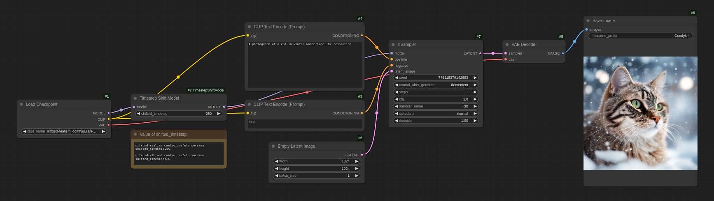

# ComfyUI-TimestepShiftModel
This is a ComfyUI implementation of the timestep shift technique used in [NitroFusion: High-Fidelity Single-Step Diffusion through Dynamic Adversarial Training](https://arxiv.org/abs/2412.02030).

For more details, visit the [official NitroFusion GitHub repository](https://github.com/ChenDarYen/NitroFusion).

## Usage
Clone this repository into the `ComfyUI/custom_nodes` directory:
```bash
git clone https://github.com/ChenDarYen/ComfyUI-TimestepShiftModel.git
```

Download the NitroSD models from [Hugging Face](https://huggingface.co/ChenDY/NitroFusion) or use the following commands:
```bash
wget https://huggingface.co/ChenDY/NitroFusion/resolve/main/nitrosd-realism_comfyui.safetensors
wget https://huggingface.co/ChenDY/NitroFusion/resolve/main/nitrosd-vibrant_comfyui.safetensors
```

The `Timestep Shift Model` node takes a model and a `shifted_timestep` value as input, producing a timestep-shifted model.

Apart from this step, the workflow is the same as a standard text-to-image generation workflow.

Have fun with the example workflow [ComfyUI_NitroSD_workflow.json](./ComfyUI_NitroSD_workflow.json)!


